# Project B : CIELAB 색 공간에서의 디헤이징 (High-Fidelity Dehazing in CIELAB Color Space)

## 📌 Overview
본 프로젝트는 "야외 촬영 환경의 품질 개선 파이프라인"의 2단계 모듈로, CIELAB 색 공간을 활용하여 **색왜곡을 최소화하는 디헤이징 알고리즘**을 구현한 것입니다. 

기존 RGB 기반 디헤이징 알고리즘은 안개 제거 과정에서 색상 왜곡이나 컬러 노이즈가 발생하는 문제가 있습니다. 
이를 해결하기 위해 **밝기(L)와 색도(a, b)를 분리하여 처리하는 구조**를 설계하였습니다.

본 방법은 Color Attenuation Prior(CAP) 기반 깊이 모델을 CIELAB 색 공간에 맞게 재정의하고, 시뮬레이션을 통해 파라미터를 재추정하여 색상 보존형 디헤이징을 수행합니다.

**핵심 특징** 
- RGB 기반 CAP 모델을 **CIELAB 색공간으로 재정의**
- **밝기 채널 중심 디헤이징 구조**
- 색도(a,b) 채널 유지로 **색상 왜곡 최소화**

※ 본 프로젝트는 Outdoor Image Enhancement Pipeline 중
Stage B (Dehazing Module)에 해당합니다.

<br>

## 🎯 Problem Definition & Solution
기존 단일 영상 디헤이징 알고리즘은 다음과 같은 문제가 존재합니다. 
- RGB 색공간 기반 처리로 인한 **색조 왜곡**
- 과도한 밝기 증가로 인한 **Halo Artifact**
- 깊이 추정 과정에서 발생하는 **노이즈 증폭**

<br>

## 💡 Proposed Solution
본 프로젝트에서는 CAP 기반 디헤이징 구조를 CIELAB 색 공간으로 재설계하여 다음과 같은 개선을 수행합니다.

### 1. CIELAB 기반 깊이 모델 재정의 
기존 CAP 모델의 RGB 기반 깊이(D) 추정식을 CIELAB 색공간의 밝기(L) + 색도색도(Δc) 기반 모델로 재구성합니다.
  ```text
  D = a1 + a2 * L + a3 * sqrt(a^2 + b^2)
  ```
  - L : 밝기 채널
  - a, b : 색도 채널
  - Δc = √(a² + b²)

### 2. 시뮬레이션 기반 파라미터 재추정
깊이 모델의 파라미터는 D-HAZY 및 NYU Depth dataset를 활용하여 다중 선형 회귀 방식으로 추정합니다. 

```text
1. 데이터세트에서 L, Δc(chroma)값 입력 변수로 추출
2. 깊이값과의 관계를 다중 선형 회귀로 분석 (Matlab의 regress 함수)
3. 결정계수 𝑅2 > 0.9인 결과만 사용
4. 최종 평균값을 파라미터로 사용
```

최종 파라미터
```text
α0 = -0.0391  
α1 = 0.9180  
α2 = -1.8072
```

### 3. 색상 보존형 디헤이징 구조
기존 RGB 기반 복원 방식 대신 **L채널에만 대기산란 모델을 적용**하여 디헤이징을 수행합니다.
```text
J(i,j)= (L(i,j)-LA) / max(0.05, min(0.95, e^(-βd(x)))) + LA
```
최종 출력은
- L: 디헤이징 결과
- a,b: 원본 유지
로 구성되어 색상 왜곡을 방지합니다.


---


## 📂 Repository Structure

```text
Project_B_dehazing
│
├── main_dehazing.m          # 디헤이징 파이프라인 실행 스크립트
│
├── core_methods/              
│   ├── estimate_lab_depth_model.m    # CIELAB 기반 깊이 추정 및 디헤이징 핵심 알고리즘
│   ├── fastguidedfilter_color.m  
│   └── boxfilter.m      
│
├── analysis/      # 시뮬레이션 기반 파라미터 재추정 알고리즘
│
├── assets/                    # README 작성용 시각화 이미지 모음
│
├── Simulation_Outputs/        # 기존 방법과 결과 비교 모음
│
└── README.md                  

```


## 🧠 Methodology

밝기(L)와 색채(a, b)가 독립적인 LAB 색 공간을 활용하여, 밝기 손실 없이 색조만 정교하게 보정합니다.

* **Step 1: Input** 화이트 밸런스가 적용된 영상을 입력으로 사용(Project_A의 결과 활용) 
* **Step 2: Depth Estimation** CIELAB 기반 깊이 모델을 이용하여 깊이맵 D를 추정 
* **Step 3: Guided Filtering** 깊이맵의 노이즈 제거를 위해 Guided Filter 적용
* **Step 4: Transmission Estimation** 투과율 계산
  ```text
  t = exp(-βD)
  ```
  t값은 안정성을 위해
  ```text
  0.05 ≤ t ≤ 0.95
  ```
* **Step 5: Dehazing** 대기 산란 모델을 활용하여 밝기 채널 복원
* **Step 6: RGB Reconstruction** 
  - 복원된 L 채널
  - 원본 a, b 채널 
  을 결합하여 RGB 영상으로 변환 

<details> 
<summary> <b> 단계별 처리 결과 시각화 (Click)</b></summary>
  <br>

  | Input(white balance) | L | D | Guided Filtering | t | J | Output(RGB) |
  | :---: | :---: | :---: | :---: | :---: | :---: | :---: |
  | 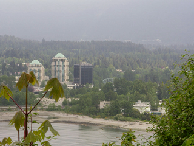 | 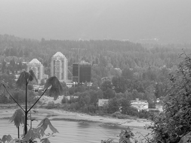 | 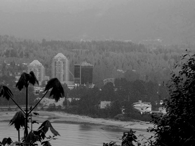 |  | 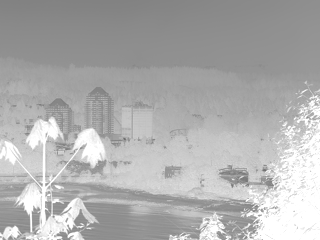 | 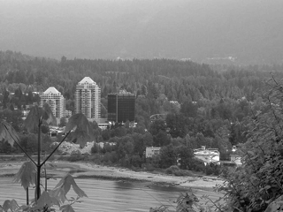 | 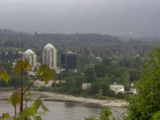 |

  <br>
  
  </details>


---


## 🔄 Processing Pipeline

| 단계 | 주요 프로세스 | 결과 및 목적 |
| :---: | :--- | :--- |
| **Step 1** | **[Input Image]** | White Balance 결과 영상 |
| ↓ | **[Depth Estimation]** | CIELAB 기반 깊이 모델 |
| ↓ | **[Guide Filtering]** | 깊이맵 노이즈 제거 |
| ↓ | **[Transmission 계산]** | 투과율 계산 |
| ↓ | **[Dehazing]** | L 채널 복원 |
| **Final Step** | **[Output Image]** | RGB 영상 출력 |


---


## 📊 Results & Comparison

본 알고리즘은 대표적인 디헤이징 기법(DCP, GIF, CAP)을 대조군으로 선택하여 비교 평가를 수행하였습니다. 비교군은 참고 논문에 표기하였습니다.
* **대조군:** DCP(Dark Channel), GIF(Guided Image Filtering), CAP(Color Attenuation Prior)
* **주요 개선 효과:** 기존 방법의 문제인 객체 주변 **Halo Artifact 감소, 색상 왜곡 감소** 및 자연스러운 대비 복원

#### Example 1 (Halo Artifact 감소)
| Input(Hazy) | DCP | GIF | CAP | **Proposed** |
| :---: | :---: | :---: | :---: | :---: |
|  | 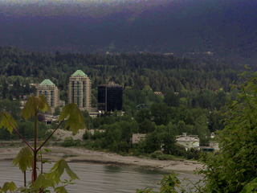 | 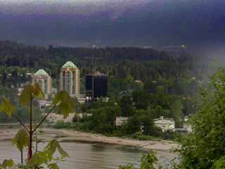 | 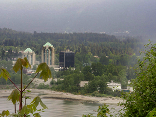 |  |


#### Example 2 (색상 왜곡 감소)
| Input(Hazy) | DCP | GIF | CAP | **Proposed** |
| :---: | :---: | :---: | :---: | :---: |
| 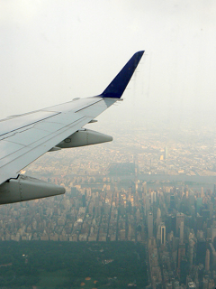 | 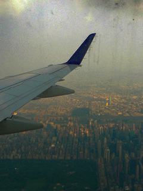 | 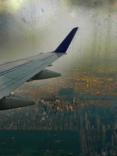 | 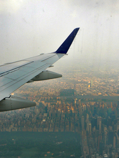 | 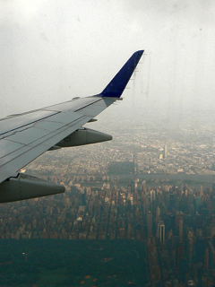 |

※ 실제 비교 결과 이미지는 Simulation_Outputs 폴더에서 확인할 수 있습니다.
<br>


---


## 💡 Limitations & Future Work

### Limitations (한계)

* **선형 깊이 모델 기반:** 깊이맵은 L 및 색도 정보를 기반으로 한 선형 모델로 추정되므로 복잡한 안개 분포를 완전히 반영하기에는 한계가 존재합니다.
* **데이터셋 기반 파라미터:** 파라미터는 D-HAZY 데이터셋을 기반으로 추정되었기 때문에 다른 촬영 환경에서는 추가적인 튜닝이 필요할 수 있습니다.
* **대기산란 모델 가정:** 실제 환경의 안개 농도 및 조명 조건이 모델 가정과 크게 다른 경우 성능이 제한될 수 있습니다.

<br>

### Future Work(개선 방향)

* 비선형 깊이 모델 기반 디헤이징
* 영상 입력 기반 **적응형 파라미터 추정**
* 딥러닝 기반 디헤이징과 결합한 **Hybrid 구조**


---


## 📄 Related Publication

* [석사 졸업 연구 보고서] 야외 촬영 환경에서 영상의 가시성 및 품질 개선 (2024)
* [SCIE] "Saturation-Based Airlight Color Restoration of Hazy Images", Applied Sciences, 2023.
* [SCOPUS] "Single-Image Dehazing based on Scene Brightness for Perspective Preservation", JICCE, 2024. 03.
* 국내 학회 발표 다수

본 연구는 석사 졸업 연구 프로젝트의 일부로 수행되었습니다.
<br>

## 📚 References
비교 평가에 사용된 기존 디헤이징 알고리즘은 다음과 같습니다.
* **DCP:** K. He, J. Sun and X. Tang, "Single image haze removal using dark channel prior," in 2009 IEEE Conference on Computer Vision and Pattern Recognition: Miami, 2009, pp. 1956-1963, DOI: 10.1109/CVPR.2009.5206515.
* **GIF:** K. He, J. Sun and X. Tang, "Guided Image Filtering," IEEE Transactions on Pattern Analysis and Machine Intelligence, vol. 35, no. 6, pp. 1397-1409, June 2013, DOI: 10.1109/TPAMI.2012.213.
* **CAP:** Q. Zhu, J. Mai and L. Shao, "A Fast Single Image Haze Removal Algorithm Using Color Attenuation Prior," IEEE Transactions on Image Processing, vol. 24, no. 11, pp. 3522-3533, Nov. 2015, DOI: 10.1109/TIP.2015.2446191.
