# Project C : 밝기 가중치 기반 저조도 개선(Brightness-weighted Low-light Enhancement)

## 📌 Overview
본 프로젝트는 **야외 촬영 환경의 품질 개선 파이프라인**의 세 번째 단계로, 디헤이징 이후로 영상에서 발생하는 **저조도 및 밝기 문제를 해결하기 위한 적응형 저조도 개선 알고리즘**을 구현한 것입니다. 

기존 저조도 개선 알고리즘은 다음과 같은 문제가 있습니다.
- 디헤이징 이후 영상에 직접 적용할 경우 기존 복원 결과를 다시 훼손
- 영상 밝기 조건에 따라 과도한 contrast 및 edge 증폭 발생
- Retinex 기반 보정 과정에서 색상 왜곡 발생
이를 해결하기 위해 본 프로젝트에서는
  **밝기 채널(L) 기반 Retinex 보정 + 입력 영상 혼합 구조**
를 설계하여 **영상의 구조 정보와 색 정보를 최대한 보존하는 저조도 보정 방법**을 제안합니다. 

**핵심 특징** 
- **Brightness-weighted Retinex fusion 구조**
- **LAB 색 공간 기반 밝기 채널 중심 보정**
- **입력 영상과 Retinex 결과 혼합을 통한 정보 보존**
- 데이터셋 분석 기반 **적응형 보정 강도 결정**

본 모듈은 **Project B의 디헤이징 결과 영상(J)을 입력으로 사용하여 저조도 환경에서의 가시성을 향상**시키는 후처리 단계로 동작합니다.

<br>

## 🎯 Problem Definition
야외 촬영 환경에서는 **안개, 역광, 그림자, 저조도**가 동시에 존재하는 경우가 많아 기존 저조도 향상 방법에는 다음과 같은 문제가 발생합니다. 
1. **복원 영상 재훼손**: 디헤이징 이후 Retinex를 직접 적용하는 경우 edge 과증폭, contrast 왜곡, texture 손실이 발생하여 **이전 단계에서 복원한 영상 품질을 다시 저하**시킬 수 있습니다.
2. **영상 밝기 조건에 따른 과보정 문제**: 기존 알고리즘은 **극단적인 저조도 영상**을 기준으로 설계된 경우가 많아 역광 영상, 부분 음영 영상에서는 **밝기 과증폭 및 edge artifacts**가 발생합니다.
3. **색상 왜곡 문제**: Retinex는 RGB 채널에 직접 적용할 경우 색 채널이 과증폭되어 **color shift 및 color distortion이 발생**할 수 있습니다.

> **💡목표:** 본 연구는 **LAB 색 공간 기반 밝기 채널 처리**와 **적응형 Retinex 가중치 설계**를 통해 위 한계들을 완화하도록 합니다.

<br>

## 📊 Dataset Analysis
### Brightness Distribution Analysis
저조도 영상의 보정 강도를 결정하기 위해 LOL(LOw-Light) 데이터셋의 밝기 분포를 분석하였습니다.
- 약 **90장의 실제 저조도 영상** 사용
- 각 영상은 다음 파이프라인을 거쳐 분석

```text
Color Correction (Project A)
      ↓
Dehazing (Project B)
      ↓
Brightness Analysis
```
디헤이징 결과 영상 $J$의 **평균 밝기**를 다음과 같이 계산합니다.
각 영상의 평균 밝기는 다음과 같이 계산된다.
- $J_{ave} = \frac{1}{N} \sum_{i=1}^{N} J_i$

- $J_i$: 디헤이징 결과 영상의 $i$번째 픽셀 밝기값  
- $N$: 전체 픽셀 수

데이터셋 전체에 대해 계산된 밝기 평균을 시각화하여 저조도 특성에 따른 영상 유형을 분석하였습니다. 

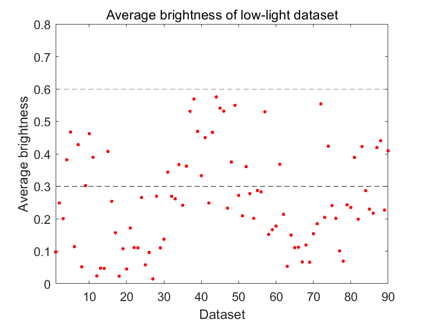 

분석 결과, 영상 밝기에 따라 다음 **3가지 유형**으로 구분할 수 있었습니다.
- Case 1(J_{ave}>0.6): 저조도 영상가 아닌 일반 영상
- Case 2($0.35 < J_{ave} \le 0.6$): 역광 혹은 부분 음영
- Case 3($J_{ave} \le 0.35$) 강한 저조도 / 야간 영상

  <details> 
  <summary> <b> $J_{ave}$에 따른 LOL 데이터세트 분류 결과 (Click)</b></summary>
  <br>
  
  기준치 0.6 이하의 데이터에 대해 0.1씩 감소하며 시뮬레이션을 진행하였으며, 0.35를 기준으로 저조도 영상이 나뉘는 것을 확인하였습니다.
  | $J_{ave}$ | 0.5690 | 0.4624 | 0.3895 | 0.2873 | 0.1141 | 0.0522 |
  | :---: | :---: | :---: | :---: | :---: | :---: | :---: |
  | images | 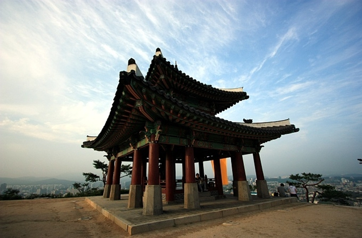 | 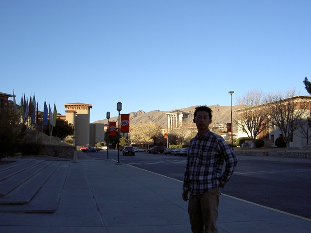 | 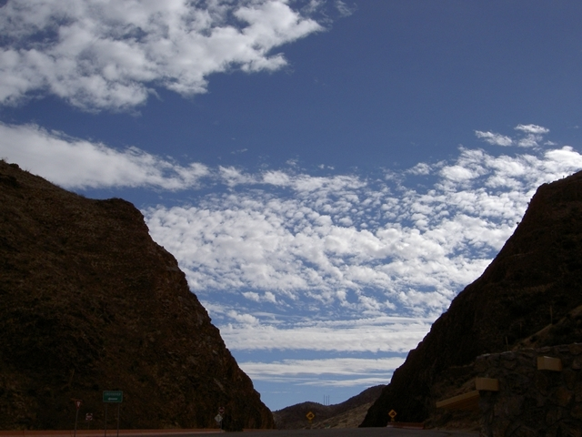 |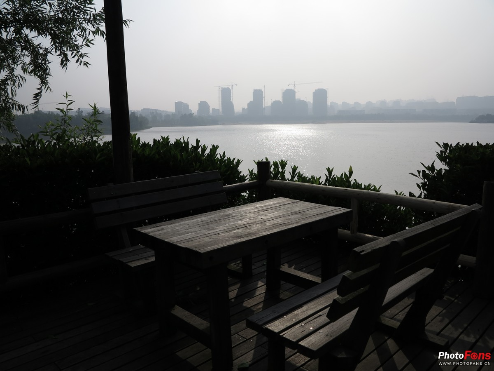 | 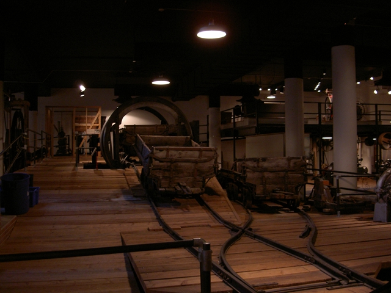 | 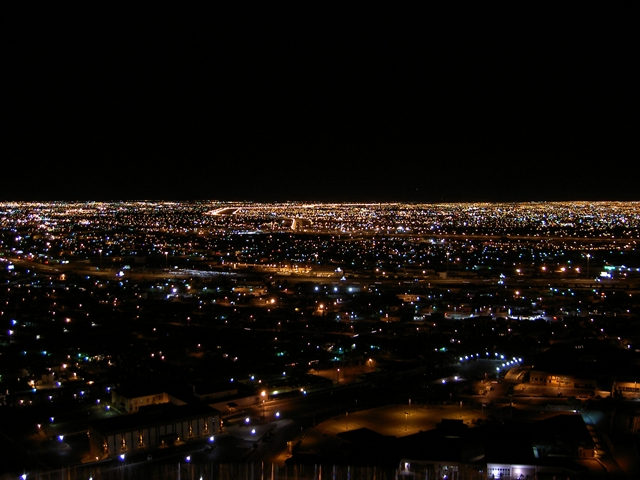 |
  
  <br>
  
  </details>

이 분석을 기반으로 **Retinex 보정 강도를 적응적으로 조절하는 가중치 전략**을 설계하였습니다.


---


## 🧠 Methodology

제안 알고리즘은 Retinex 기반 발기 보정 결과와 입력 영상 정보를 혼합하는 방식으로 동작합니다.

* **Step 1. Retinex 기반 밝기 보정:** 디헤이징 결과 영상 $J$의 밝기 채널에 **Single Scale Retinex (SSR)**를 적용합니다.
  - $log{R_{SSR}} = log(J) - log(Gaussian * J)$
* **Step 2. 영상 평균 밝기 계산:** 영상의 전체 밝기 평균 $J_{ave}$을 계산하여 **영상의 저조도 정도**를 판단합니다.
* **Step 3. Adaptive Weight Assignment:** 밝기 평균값에 따라 **3가지 보정 Case**로 분류하고 Retinex 가중치를 설정합니다.
  - Case 1. $0.6 < J_{ave} $ → $W_{SSR}$ = 0 (보정 불필요)
  - Case 2. $0.35 < J_{ave} \le 0.6$ → $W_{SSR}$ = 0.4 
  - Case 3. $J_{ave} \le 0.35$ → $W_{SSR}$ = 0.8 (강한 보정)
* **Step 4. Brightness-weighted Fusion:** 입력 영상과 Retinex 결과를 다음과 같이 혼합합니다. 
  - $R = W_{SSR}R_{SSR} - (1-W_{SSR})J$

  <details> 
  <summary> <b> 밝기 평균에 따른 적응형 보정 결과 (Click)</b></summary>
  <br>
  
  영상 특성에 맞춰 가중치($W_{SSR}$)가 적응적으로 작동하여 과보정없이 컬러 캐스트만 효과적으로 제거한 결과를 RGB 영상으로 변환하여 나타내었습니다.
  
  * **결과:** 입력 영상이나 J 영상 바로 직후에 Retinex를 사용하는 경우는 저조도가 적은 밝은 영상(Case 1)에서 밝기가 과하게 증폭하며 원 정보를 잃었습니다. 또한, 음영이 있는 영상(Case 2)과 과한 저조도 영상(Case 3)에 대해 밝기 과증폭 및 edge artifacts**가 발생하였습니다. 
  반면, 제안한 방법은 가중치를 이용한 적응형 보정을 통해 **Retinex의 밝기 향상 효과, 입력 영상의 원본 구조 정보**를 동시에 유지할 수 있습니다.  
  
  | | Original | Dehazing Input(J) | Original(L) + SSR | J + SSR | Proposed(R_{SSR}) |
  | :---: | :---: | :---: | :---: | :---: | :---: |
  | Case 1 (보정 없음, $W_{SSR}$ 0) | 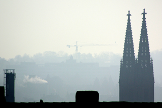 |  | 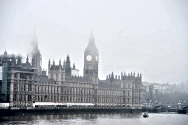 |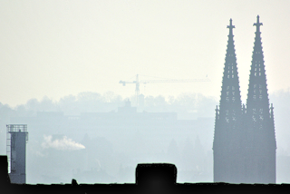 | 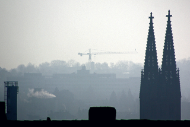 |
  | Case 2 ($W_{SSR}$ 0.4) | 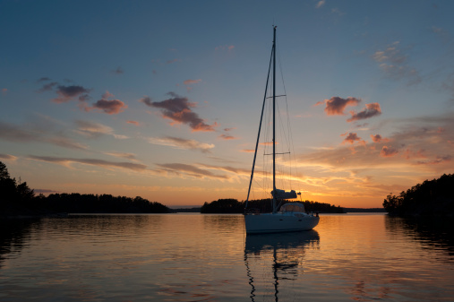 | 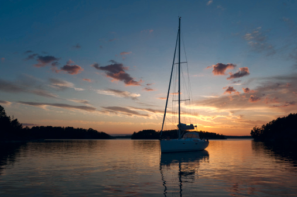 | 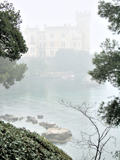 |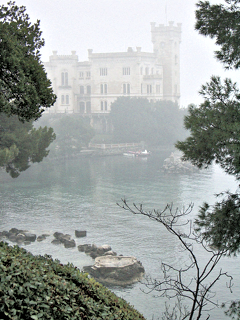 | 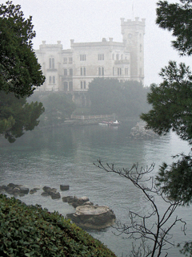 |
  | Case 3 ($W_{SSR}$ 0.8) | 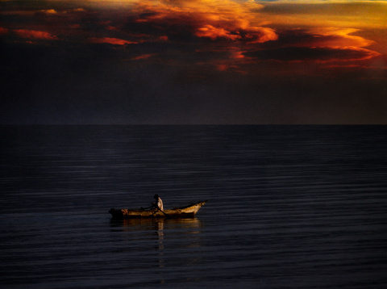 | 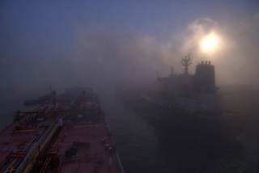 | 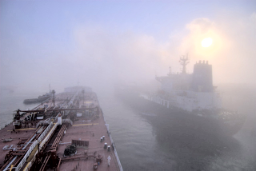 |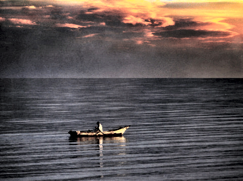 | 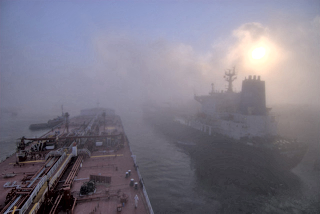 |

  <br>

  </details>

<br>


---
## 📂 Repository Structure

```text

Project_B_dehazing
│
├── main_lowlight_enhancement.m.m          # 저조도 향상 파이프라인 실행 스크립트
│
├── core_methods/              
│   ├── brightness_weighted_retinex_fusion.m    # 밝기 가중치 기반 레티넥스 핵심 알고리즘
│   └── ssr_retinex.m      
│
├── analysis/      # 시뮬레이션 기반 밝기 가중치 분석 알고리즘
│
├── assets/                    # README 작성용 시각화 이미지 모음
│
├── Simulation_Outputs/        # 기존 방법과 결과 비교 모음
│
└── README.md                  
             

```


---


## 🔄 Processing Pipeline

전체 알고리즘 흐름은 다음과 같습니다.
| 단계 | 주요 프로세스 | 결과 및 목적 |
| :---: | :--- | :--- |
| **Step 1** | **[Input Image]** | 디헤이징 결과 영상 입력 |
| ↓ | **[Singe-scale Retinex]** | SSR 기반 밝기 보정 |
| ↓ | **[Brightness Estimation]** | 평균 밝기 계산 |
| ↓ | **[Adaptive Weight Selection]** | 밝기 기반 가중치 결정 |
| ↓ | **[Weighted Fusion]** | Retinex 결과와 입력 영상 혼합 |
| **Final Step** | **[Output Image]** | 최종 저조도 보정 영상 출력 |

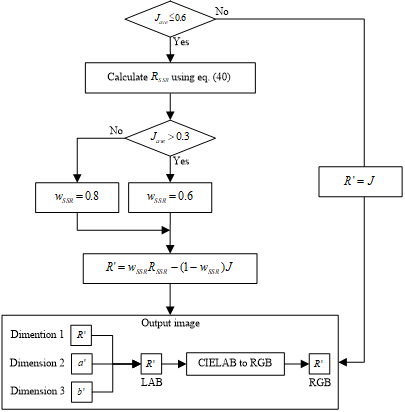


---


## 📊 Results & Comparison

### 시뮬레이션(Simulation) 비교 알고리즘

제안 알고리즘은 다음 기존 저조도 개선 알고리즘과 비교되었습니다.(상세 내역은 참고 논문 표기)
- MSR (Multi-scale Retinex)
- CLAHE (contrast limited adaptive histogram equalization)
- NGCCLAHE (normalized gamma transformation based contrast limited adaptive histogram equalization)

* **결과:** Retinex 기반 방법에서 발생하는 warm tone 과증폭 문제, CLAHE 기반 방법에서 발생하는 contrast 과도 증가를 완화하면서 **자연스러운 밝기 향상**을 달성하였습니다.

특히 **안개 + 저조도 + 컬러캐스트가 혼재된 환경**에서 안정적인 복원 결과를 이루었습니다. 

#### 1. Normal Low-light Scene
| Input(Low-light) | MSR | CLAHE | NGCCLAHE | **Proposed Algorithm** |
| :---: | :---: | :---: | :---: | :---: |
| 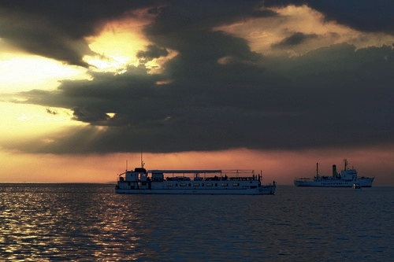 | 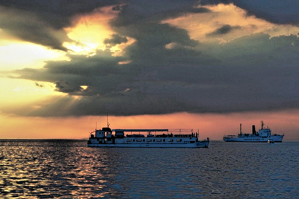 | 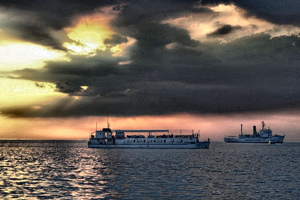 | 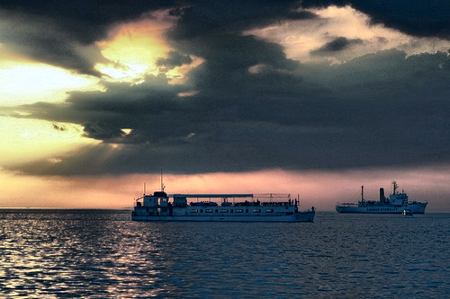 | 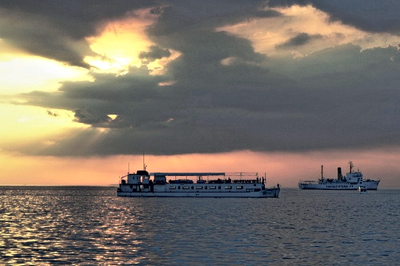 |

#### 2. Complex Low-light Scene (Haze / Color Distortion)
| Input(Low-light) | MSR | CLAHE | NGCCLAHE | **Proposed Algorithm** |
| :---: | :---: | :---: | :---: | :---: |
| 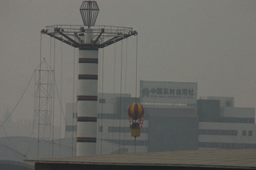 | 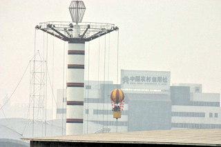 | 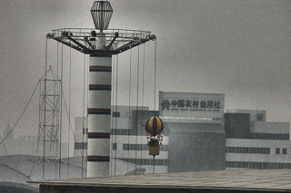 | 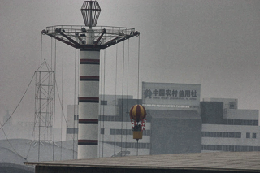 | 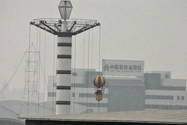 |

<br>

※ 본 프로젝트는 전체 알고리즘의 3단계 모듈이므로, 단일 모듈에 대한 정량적 평가 대신 시각적 안정성 확보에 주력하였습니다. 전체 시스템의 정량적 평가(PSNR/SSIM) 결과는 [최상위 레포지토리]에 통합할 예정입니다. 


---


## ⚠ Limitations & Future Work

### Limitations (한계)

* **데이터세트 의존적인 임계값**: 밝기 임계값은 **LOL 데이터셋 분석을 기반으로 경험적으로 설정**되었습니다. 따라서 다른 환경에서는 최적의 임계값이 달라질 수 있습니다.
* **전역 밝기 기반 판단**: 영상 전체 평균 밝기를 기준으로 판단하기 때문에 부분 조명, 강한 국부 음영 환경에서는 **영상의 실제 조명 분포 조건을 완전히 반영하지 못할 수 있습니다.**
* **Retinex 기반 과보정 가능성**: Retinex 기반 보정은 매우 어두운 영상에서 노이즈 증폭이 발생할 가능성이 있습니다.

<br>

### Future Work(개선 방향)

* **학습 기반 임계값 자동 설정:** 영상 밝기 통계를 기반으로 임계값을 자동 학습하는 모델을 적용하여 데이터셋 의존성을 줄일 수 있습니다.
* **로컬 밝기 기반 적응형 처리:** 평균 밝기 대신 로컬 밝기 혹은 적응형 영역 분할을 통해 **정밀한 영상 보정**을 설계할 수 있습니다.
* **잡음 제거와 혼합된 Retinex:** Retinex 모델에 잡음 제거 방법을 결합하여 저조도 환경에서의 잡음 증폭 문제를 완화할 수 있습니다. 

<br>


---


## 📄 Related Publication

* [석사 졸업 연구 보고서] 야외 촬영 환경에서 영상의 가시성 및 품질 개선 (2024)
* [Conference] “영상의 가시성 향상을 위한 잡음 제거 및 디헤이징” ,한국기계가공학회, 2023.
* [Conference] "저조도의 S&P 잡음 영상을 복원하기 위한 적응형 선형 보간 평균 필터", 대한전자공학회, 2022.


## 📚 References
비교 평가에 사용된 기존 화질 개선 알고리즘은 다음과 같습니다.
* **MSR:** Jobson et al., A multiscale retinex for bridging the gap between color images and the human observation of scenes, IEEE TIP, 1997.
* **CLAHE:** Zuiderveld, Contrast Limited Adaptive Histogram Equalization, Graphics Gems IV, 1994.
* **NGCCLAHE:** Shi et al., Normalized gamma transformation-based CLAHE with color correction, IET Image Processing, 2020.
